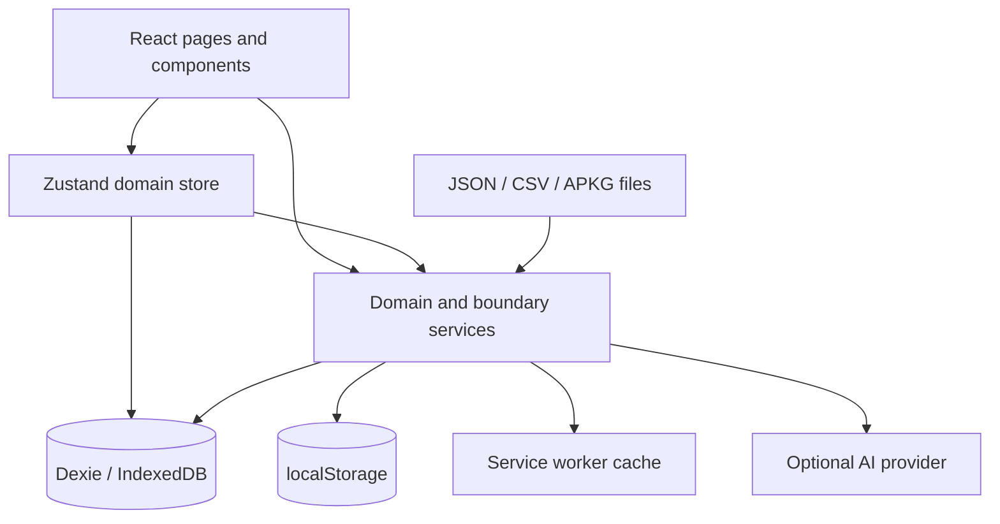

# Denki Architecture

This document defines Denki's current engineering boundaries and the invariants that protect learner data, scheduling correctness, media integrity, offline releases, and recovery.

## Product boundary

Denki is a local-first spaced-repetition workspace. The browser or Tauri WebView owns the primary database. There is no account system, hosted application database, analytics pipeline, or mandatory cloud dependency.

Optional AI generation is the only flow that sends learner-supplied content to a third party. It runs only after an explicit action and uses the endpoint and API key configured by the learner.



UI code may request work, but scheduling, validation, persistence, sanitisation, backup, and media-integrity rules belong below the component layer.

## Application shell

`src/main.tsx` mounts React, imports global styles, registers production service-worker behaviour, and flushes transient state during browser lifecycle events.

`src/App.tsx` owns:

- startup restoration and database hydration;
- persistent-storage and backup-safety checks;
- route composition and lazy page loading;
- application and study-route error boundaries.

Startup failures must be visible. A database, migration, or restoration error must never look like successful initialization.

`src/components/ui/GlobalUI.tsx` owns application-wide transient UI and the single document-scoped media hydrator. Individual study modes must not install competing hydrators or unmanaged object URLs.

## Domain state

`src/store/useFlashcardStore.ts` composes five Zustand slices:

- classes;
- decks;
- cards;
- study sessions;
- statistics.

`src/store/uiStore.ts` remains separate because toasts, confirmation dialogs, command-palette state, and similar controls are not part of the durable study model.

Store invariants:

1. Persistent mutations validate IDs and relationships at the store or service boundary.
2. Related database writes use a Dexie transaction.
3. A failed durable write must not be represented as success in memory.
4. Destructive changes invalidate active sessions that reference changed or deleted cards.
5. Asynchronous loaders use latest-request guards so stale IndexedDB reads cannot overwrite newer navigation state.
6. Metrics are labelled by what they actually measure; FSRS Review state is not called mastery.

## Database

`src/db/index.ts` defines Dexie versions and migrations. `src/db/schema.ts` defines durable shapes.

Schema v6 has five tables:

- `classes`;
- `decks`;
- `cards`;
- `reviews`;
- `media`.

Cards and review logs carry denormalised class/deck IDs for indexed scoped queries. IndexedDB does not enforce foreign keys, so imports, restores, and destructive operations must preserve those relationships explicitly.

### Scheduler provenance — schema v5

Every persisted card state and review transition carries `schedulerVersion`:

- card provenance identifies the scheduler lineage that produced the current memory state;
- review provenance identifies the scheduler used for that transition.

Migration v5 does **not** recalculate interval, stability, difficulty, state, due date, or rating. It classifies:

- pristine, unreviewed New cards as current `4.5`;
- all other unversioned cards and review logs as `legacy-unversioned`;
- valid explicit provenance without modification.

Database create hooks provide defense-in-depth for direct imports and fixtures, but production flows should still use explicit scheduler/card-initialisation helpers.

### Runtime media registry — schema v6

The `media` table is keyed by:

```text
SHA-256(normalized MIME + NUL + exact persisted bytes)
```

A row stores canonical MIME, byte length, `ArrayBuffer`, and creation time. Schema v6 creates an empty table and deliberately performs no card-text migration.

Database rules:

- every schema change requires a new Dexie version and real migration coverage;
- migrations must preserve existing rows unless deletion is an explicit product decision;
- Date fields must be revived as real `Date` objects before writes;
- uncertain scheduler history must never be relabelled canonical;
- media rows must be verified before they are served or exported;
- complete backup replacement must include all five tables in one transaction.

## Release identity

`version.json` is the canonical semantic application version. It must match:

- `src-tauri/tauri.conf.json`;
- the Rust package version in `src-tauri/Cargo.toml`;
- the `denki` entry in `src-tauri/Cargo.lock`.

The root npm package is a private workspace and intentionally remains `0.0.0`.

Vite injects:

- `__DENKI_VERSION__` — semantic application version;
- `__DENKI_BUILD_ID__` — immutable source identity for that artifact.

The build emits `dist/version.json`. The visible version, service-worker cache identity, deployed artifact, and release tag must refer to the same release.

Release invariants:

1. Use `npm run version:set -- <version>` or an equivalent complete update.
2. `npm run test:version` must pass before compilation.
3. The final artifact validator checks semantic version and expected commit identity.
4. Pages deployment receives the successful CI `head_sha` explicitly.
5. Generated release metadata is never edited or committed manually.

## Scheduler

`src/services/scheduler.ts` implements canonical FSRS 4.5 long-term equations plus the documented short learning-step state machine.

The explicit scheduler gate pins:

- the published 17-weight vector;
- `DECAY = -0.5`;
- `FACTOR = 19/81`;
- forgetting-curve and target-retention vectors;
- New, Learning, Review, and Relearning transitions;
- pre-review difficulty in stability updates;
- strict `Hard < Good < Easy` Review intervals;
- maximum-interval boundaries.

Scheduler invariants:

1. Model weights are not user-adjustable.
2. Target retention is the only persisted scheduler parameter.
3. No custom Hard/Easy multipliers may coexist with the canonical FSRS 4.5 claim.
4. Manual confidence and Review Mode use the same scheduler path.
5. Every current transition stamps both card and review log with `4.5`.
6. Existing stability/difficulty values remain authoritative unless a separately designed migration says otherwise.
7. A future scheduler must introduce a new lineage value rather than overwriting history.

## Study sessions

Session scopes remain distinct:

- scheduled deck review;
- scheduled class review;
- scheduled global mixed review;
- all-card practice;
- one-pass deck Drill.

A persisted session stores card IDs and counters, not duplicate card content. Restoration validates snapshot version, age, scope/mode identity, indices, card existence, and membership. Completed sessions are discarded. Undo history intentionally does not survive reload.

Review durability order:

1. calculate the next canonical state and provenance;
2. write card and review log in one transaction;
3. advance the in-memory queue;
4. refresh non-critical caches/analytics;
5. persist the resumable cursor.

A cache refresh failure must not duplicate an already durable review.

## Untrusted input

Denki treats Markdown/HTML, CSV, APKG files, JSON backups, AI responses, localStorage values, route parameters, media rows, and user-configured URLs as untrusted.

### Markdown and mixed media rendering

`src/services/markdown.ts` is the single rendering path for Review, Learn, Match, and deck notes.

For runtime registry references:

1. exact `denki-media://sha256/<hash>` values become opaque tokens before Markdown parsing;
2. DOMPurify sanitizes the complete output with user data attributes disabled;
3. trusted post-sanitisation code creates inert media bindings with no active URI attribute;
4. the app-wide hydrator verifies registry bytes and acquires a managed object URL;
5. only then is `src`, `poster`, or supported `href` installed.

Existing safe data URLs remain supported. Missing/corrupt registry media produces an accessible fallback. `srcset` is forbidden until every candidate can be validated independently. One rendered content block is capped at 256 registry references.

### CSV

CSV parsing supports quoted multiline values, escaped quotes, BOMs, and malformed-row reporting. Parsing and destination validation finish before the atomic card write.

### Anki packages

The local Anki importer preflights ZIP structure and declared output before decompression, caps streamed output, decodes only referenced media, sanitizes HTML/SVG, and commits decks/cards atomically.

Compatibility remains field-based for supported Basic and cloze-style material. Complex templates, CSS, add-ons, and full Anki scheduling parity are outside the product promise.

### AI providers

AI endpoints are URL-validated, remote plaintext HTTP is rejected, input/output is bounded, requests time out, and response shapes are checked. Provider output creates editable drafts; it does not bypass destination or store validation.

## Runtime media integrity

The registry accepts a narrow passive image/audio/video MIME allow-list. Each asset is limited to 16 MiB. SVG is sanitized before hashing and storage.

`resolveMediaAsset()` verifies:

- key syntax;
- canonical MIME;
- declared/actual byte length;
- creation timestamp;
- recomputed SHA-256.

`acquireMediaObjectUrl()` provides reference-counted leases:

- concurrent requests for one hash share one load and one URL;
- the final release revokes the URL;
- connected DOM reparenting preserves the lease;
- removed nodes release leases;
- hydrator teardown restores inert bindings before revocation;
- at most 256 hashes may have active URLs.

See `docs/media-registry.md` for the complete contract.

## Portable backup v5

Backup v5 is registry-native and represents a complete local database snapshot.

### Export

All five tables are read within one Dexie read transaction. The portable media envelope deduplicates equal MIME-plus-bytes content and labels each row:

- `embedded` — hydrate back to exact data-URL text only;
- `registry` — restore to the runtime media table;
- `both` — hydrate and persist from one shared row.

Registry-only assets are retained because backup represents complete local state, not only currently referenced content.

### Validation

Before current data or preferences are changed, import validates:

- envelope/application/database/scheduler versions;
- dates, IDs, relationships, preferences, and scheduler provenance;
- exact media shape and usage;
- canonical MIME, base64, byte length, and timestamp;
- recomputed SHA-256;
- embedded and runtime reference completeness;
- duplicate/malformed references;
- 5,000-object, 16 MiB per-object, and 160 MiB total decoded limits.

Every persisted runtime registry reference must have a registry row. Embedded rows may not be orphaned; registry-only rows may be.

### Replacement

Classes, decks, cards, reviews, and media are cleared and restored in one Dexie write transaction. Any failure rolls back all five tables. Preference writes retain their rollback path. Existing object URLs are revoked only after the durable replacement commits.

Formats v1-v4 remain importable through conservative provenance/media normalization. They restore no runtime registry, clear any current registry during complete replacement, and reject future runtime-registry references that those formats cannot carry.

The AI-provider key is excluded from every backup.

## Offline and distribution

Vite emits hashed JavaScript, CSS, and WASM assets. The precache plugin emits:

- `sw-assets.json` — complete generated code-asset set;
- `version.json` — semantic version and immutable build identity.

Service-worker installation is atomic: every required shell, release-metadata, code, style, and WASM asset must cache successfully. A partial release must not activate.

`npm run test:artifact` validates required files, entrypoints, CSP, manifest, local references, exact precache coverage, atomic installation semantics, semantic version, and build identity.

Pages deployment checks out the exact successful CI commit, rebuilds it, and reruns artifact validation before upload.

The Tauri wrapper uses the same web app and IndexedDB model. Web and Tauri CSPs are validated together; capabilities remain least-privilege. Platform support must not be claimed until its bundle is built and smoke-tested.

## Security and release gates

A releasable exact head passes:

1. clean `npm ci`;
2. production dependency audit;
3. release-version contract;
4. strict TypeScript;
5. web/Tauri security validation;
6. canonical FSRS gate;
7. zero-warning ESLint;
8. complete Vitest suite, including migrations, provenance, backup, media integrity, reference completeness, and rollback;
9. production build;
10. artifact/build-identity validation;
11. CodeQL `security-extended` analysis.

Repository-level rules should additionally require the relevant status checks on `main`, prevent force pushes/deletion, and require pull-request-based changes.

## Change review

Before implementing a change, identify whether it touches:

- version/build identity;
- persisted data or schema migration;
- scheduler semantics/provenance;
- study-session recovery;
- untrusted input;
- media integrity/rendering;
- backup representation/recovery;
- offline caching;
- security policy;
- analytics meaning;
- platform distribution.

Then define user impact, non-goals, compatibility, failure/rollback behaviour, regression coverage, integration coverage, and documentation impact.

Do not solve domain problems in JSX, duplicate sanitisation rules, bypass store validation with direct database writes, relabel uncertain history as canonical, persist registry references without recoverability, or weaken a release gate to make a change pass.
