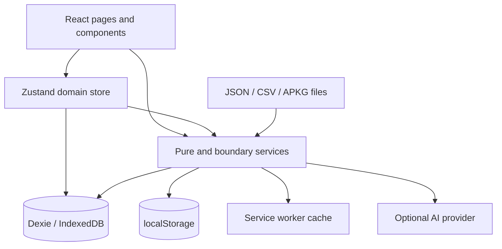

# Denki Architecture

This document describes Denki's current engineering structure, the boundaries that protect learner data, and the invariants that future changes must preserve.

## Product boundary

Denki is a local-first spaced-repetition workspace. The browser or Tauri WebView owns the learner's primary database. There is no account system, hosted application database, analytics pipeline, or mandatory cloud dependency.

Optional AI generation is the only product flow that sends learner-supplied content to a third-party service. That request occurs only after an explicit user action and uses the endpoint and API key configured by the learner.

## System overview

The arrows are deliberately one-directional. UI code may request work, but domain state and persistence rules belong below the component layer.

## Runtime layers

### 1. Application shell

`src/main.tsx` mounts React, registers production service-worker behaviour, and performs the limited lifecycle work that must happen outside React.

`src/App.tsx` owns:

- startup restoration and database hydration;
- persistent-storage and backup-safety checks;
- route composition;
- lazy page loading;
- application and study-route error boundaries.

Startup must fail visibly. A database or restoration error must never leave a blank screen that looks like successful initialization.

### 2. Pages and components

Pages orchestrate user flows. Components render controls and local interaction state. They should not recreate persistence, scheduling, import, or sanitisation rules.

Important page boundaries include:

- `DashboardPage`: global study entry and analytics;
- `ClassViewPage`: class/deck organisation and scoped actions;
- `StudySessionPage`: active Review, Drill, Learn, and Match flows;
- `AIGeneratePage`: explicit provider-backed draft generation and review.

Reusable modal components own presentation and form state, while Zustand actions own durable mutations.

### 3. Domain state

`src/store/useFlashcardStore.ts` composes five Zustand slices:

- `classSlice`;
- `deckSlice`;
- `cardSlice`;
- `studySlice`;
- `statsSlice`.

`src/store/uiStore.ts` is separate because transient UI concerns such as toasts and confirmation dialogs are not part of the learner's study model.

Store invariants:

1. Persistent mutations validate IDs and relationships at the store or service boundary.
2. Related database writes use a Dexie transaction.
3. A failed durable write must not be represented as success in memory.
4. Destructive mutations invalidate active sessions that reference deleted or edited cards.
5. Asynchronous loaders use latest-request guards so stale IndexedDB results cannot overwrite a newer navigation scope.
6. Derived statistics describe what is actually measured. FSRS `Review` state is not labelled as mastery.

### 4. Database

`src/db/index.ts` defines the Dexie database and migrations. `src/db/schema.ts` defines the persisted record shapes.

Core tables:

- `classes`;
- `decks`;
- `cards`;
- `reviews`.

The schema stores denormalised `classId` and `deckId` values on cards and review logs to support indexed scoped queries. Because IndexedDB does not enforce foreign keys, Denki must validate and preserve these relationships itself.

Database rules:

- schema changes require a new Dexie version and migration tests;
- migrations must be deterministic and safe to rerun only as Dexie permits;
- imports and restores validate complete referential integrity before replacing data;
- class, deck, card, and review deletion must not leave orphaned records;
- Date fields must be revived as real `Date` values before IndexedDB writes.

## Scheduler boundary

`src/services/scheduler.ts` implements canonical FSRS 4.5 long-term memory equations plus the documented short learning-step state machine.

Release-critical constants and behaviour are pinned by `src/services/__tests__/scheduler.test.ts`:

- the published 17-weight vector;
- `DECAY = -0.5`;
- `FACTOR = 19/81`;
- forgetting-curve vectors;
- target-retention interval vectors;
- New, Learning, Review, and Relearning transitions;
- pre-review difficulty in stability updates;
- strict `Hard < Good < Easy` Review intervals;
- maximum-interval boundary behaviour.

Scheduler invariants:

1. The published model weights are not user-adjustable.
2. Target retention is the only persisted user scheduler parameter.
3. Custom Hard or Easy multipliers are not permitted under the "canonical FSRS 4.5" claim.
4. Manual confidence changes use the same scheduler and review-log transaction as Review Mode.
5. Any scheduler change requires externally derived golden vectors and must keep `npm run test:scheduler` as an explicit release gate.
6. Existing stored stability and difficulty values remain authoritative unless a separately designed, tested, and communicated migration is introduced.

## Study sessions

A study session is an in-memory queue plus a compact resumable cursor.

Session scopes are distinct:

- scheduled deck review;
- scheduled class review;
- scheduled global mixed review;
- all-card practice;
- one-pass deck Drill.

A persisted session stores card IDs and counters, not duplicate card content. Restoration rehydrates current card records from IndexedDB and validates:

- snapshot version and age;
- scope identity;
- Drill/practice/scheduled mode identity;
- queue indices;
- card existence;
- class/deck membership.

Completed sessions are not restored. Undo history intentionally does not survive reload because it contains full pre-mutation queue snapshots and database rollback identifiers.

Review durability order:

1. calculate the next FSRS state;
2. write the updated card and review log in one transaction;
3. advance the in-memory queue;
4. coalesce non-critical analytics refreshes;
5. persist the resumable cursor.

A cache or analytics refresh failure must not duplicate an already durable review.

## Untrusted input boundaries

Denki treats all imported or externally generated content as untrusted.

### Markdown and HTML

`src/services/markdown.ts` is the shared rendering path. Markdown output passes through DOMPurify before entering the DOM. Review, Learn, and Match must not develop separate rendering policies.

### CSV

`src/services/csvImport.ts` parses quoted multiline CSV, escaped quotes, BOMs, and malformed final rows. Parsing and destination validation finish before the atomic card write.

### Anki packages

`src/services/ankiImport.ts` performs bounded, local field import for supported Basic and cloze-style material. The ZIP archive is inspected before decompression and is rejected for unsafe or unsupported structures, including excessive output, duplicate paths, ZIP64, encryption, and unsupported compression.

Only referenced media is decoded. Deck and card creation share one transaction.

This is not a complete Anki template renderer. Complex note models, template logic, CSS, and exact multi-template parity are outside the current compatibility promise.

### Backup files

Portable backup v2 separates:

- backup envelope version;
- IndexedDB schema version;
- scheduler-version metadata;
- portable non-secret preferences;
- study data.

All metadata, dates, IDs, relationships, and preferences are validated before current database rows are cleared. Legacy data-only backups remain supported. Preference changes roll back if the database replacement transaction fails.

The AI-provider key is explicitly excluded.

### AI providers

`src/services/ai.ts` validates endpoint URLs, refuses plaintext remote HTTP, caps input and output size, enforces a timeout, and accepts only supported response shapes. Provider output creates editable drafts; it does not bypass user review or store mutation validation.

## Offline and distribution

### Web/PWA

Vite emits hashed JavaScript, CSS, and WASM assets. `vite-plugin-precache.ts` emits `sw-assets.json` containing the complete generated code-asset set.

`public/sw.js` installs a release atomically: every required shell and generated asset must cache successfully. A partially cached release must not activate.

`npm run test:artifact` validates the final `dist` directory, including:

- required files;
- resolved entrypoints;
- CSP invariants;
- manifest fields and icons;
- local document references;
- exact JS/CSS/WASM precache coverage;
- atomic service-worker installation behaviour.

GitHub Pages deployment checks out the exact commit that passed CI, rebuilds it, and reruns artifact validation before upload.

### Tauri

The Tauri wrapper uses the same web application and IndexedDB model. Its capability file grants only core application access. The web and Tauri CSPs are validated together so a future change cannot silently weaken one runtime.

A desktop release should not be claimed as supported on a platform until its bundle is built and smoke-tested on that platform.

## Security controls

Security is layered:

- strict TypeScript;
- zero-warning ESLint;
- explicit DOM sanitisation;
- untrusted-input limits;
- CSP validation for web and Tauri;
- least-privilege Tauri capabilities;
- production dependency audit;
- CodeQL `security-extended` analysis;
- release-artifact validation;
- transactional persistence and rollback tests.

See `SECURITY.md` for reporting guidance.

## CI and release gates

A change is releasable only after all relevant checks pass on its exact head:

1. clean `npm ci`;
2. production dependency audit;
3. strict TypeScript;
4. security-configuration validation;
5. canonical FSRS release gate;
6. zero-warning ESLint;
7. complete Vitest suite;
8. production build;
9. release-artifact validation;
10. CodeQL analysis.

Repository administrators must additionally enforce the `Release checks` and CodeQL status checks through a GitHub ruleset for `main`.

## Adding or changing functionality

Before implementation, identify which invariant the change touches:

- persisted data;
- scheduler semantics;
- session restoration;
- untrusted input;
- offline caching;
- security policy;
- analytics meaning;
- platform distribution.

Then provide:

- explicit user impact and non-goals;
- compatibility behaviour;
- failure and rollback behaviour;
- regression tests at the lowest useful layer;
- integration coverage when multiple boundaries interact;
- documentation updates when the public product promise changes.

Do not solve domain problems inside JSX, duplicate sanitisation rules, bypass store validation with direct database writes, or weaken a release gate to make a change pass.
